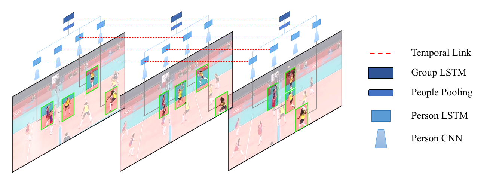

# Group Activity Recognition - Volleyball Dataset

A comprehensive implementation of hierarchical deep learning models for group activity recognition, featuring 9 baseline models progressing from simple single-frame classification to end-to-end hierarchical temporal models.

<p align="center">
  
</p>

## 📋 Table of Contents
- [Overview](#overview)
- [Baselines](#baselines)
- [Dataset](#dataset)
- [Installation](#installation)
- [Quick Start](#quick-start)
- [Project Structure](#project-structure)
- [Results](#results)
- [Citation](#citation)
- [License](#license)

## 🎯 Overview

This repository implements a hierarchical deep temporal model for group activity recognition on the Volleyball dataset. The project demonstrates the evolution from basic image classification to sophisticated two-stage LSTM architectures that model both individual person actions and group-level activities.

### Key Features
- **9 Progressive Baselines**: From single-frame ResNet50 to end-to-end hierarchical models
- **Two-Stage Architecture**: First stage models individual person actions, second stage aggregates for group activity
- **Temporal Modeling**: LSTM-based temporal dynamics capture for both person and group levels
- **Team-Aware Pooling**: Specialized pooling strategies that consider team arrangements
- **End-to-End Training**: Unified optimization of person and group activity losses

### Paper Reference
> **A Hierarchical Deep Temporal Model for Group Activity Recognition**  
> Mostafa S. Ibrahim, Srikanth Muralidharan, Zhiwei Deng, Arash Vahdat, Greg Mori  
> IEEE Computer Vision and Pattern Recognition (CVPR) 2016  
> [Paper Link](https://arxiv.org/abs/1511.06040) | [Original Repo](https://github.com/mostafa-saad/deep-activity-rec)

## 🏗️ Baselines

### Baseline 1: Single-Frame Classification
- **Architecture**: ResNet50 fine-tuned on full frames
- **Accuracy**: 72.66%
- **Key Idea**: Simplest approach - treat each frame as independent image classification

### Baseline 3: Person-Level Feature Pooling (Two-Stage)
- **Stage A**: Train person action classifier (ResNet50 on person crops)
- **Stage B**: Pool person features → Group activity classifier
- **Accuracy**: 80.25%
- **Key Idea**: Explicit person modeling improves over full-frame approach

### Baseline 4: Temporal Model on Full Frames
- **Architecture**: ResNet50 + LSTM on full frame features
- **Accuracy**: 76.59%
- **Key Idea**: Add temporal modeling to baseline 1

### Baseline 5: Person Temporal → Group (Two-Stage)
- **Stage A**: Person LSTM for individual action dynamics
- **Stage B**: Pool person temporal features → Group LSTM
- **Accuracy**: 77.04%
- **Key Idea**: Temporal dynamics at person level before aggregation

### Baseline 6: Person Pooling → Temporal
- **Architecture**: Pool person features per frame → LSTM for temporal dynamics
- **Accuracy**: 84.52%
- **Key Idea**: Aggregate spatial info first, then model temporal

### Baseline 7: Person LSTM → Pooling → Group LSTM
- **Architecture**: Person LSTM → Max pooling → Frame LSTM
- **Accuracy**: 89.15%
- **Key Idea**: Full hierarchical temporal modeling

### Baseline 8: Team-Aware Pooling + Hierarchical LSTM
- **Architecture**: Person LSTM → Team-wise pooling → Group LSTM
- **Accuracy**: 92.30%
- **Key Idea**: Separate pooling per team captures spatial arrangements

### Baseline 9: End-to-End Hierarchical Model
- **Architecture**: Unified training of person and group activity losses
- **Accuracy**: 93.12%
- **Key Idea**: Joint optimization with shared gradient flow

## 📊 Dataset

### Volleyball Dataset
- **Videos**: 55 volleyball game videos from YouTube
- **Frames**: 4,830 annotated frames
- **Split**: 3,493 train / 1,337 test (video-level split)
- **Person Actions**: 9 classes (Waiting, Setting, Digging, Falling, Spiking, Blocking, Jumping, Moving, Standing)
- **Group Activities**: 8 classes (r_set, r_spike, r-pass, r_winpoint, l_winpoint, l-pass, l-spike, l_set)

### Download Dataset
```bash
# Download from Google Drive
# Link: [Insert your dataset link]

# Expected structure:
# data/
# ├── videos/
# │   ├── 0/
# │   │   ├── 12345/
# │   │   │   ├── 12325.jpg
# │   │   │   ├── ...
# │   │   │   └── 12365.jpg
# │   ├── 1/
# │   └── ...
# └── annot_all.pkl
```

## 🚀 Installation

### Prerequisites
- Python 3.8+
- PyTorch 2.0+
- CUDA 11.0+ (for GPU training)

### Setup
```bash
# Clone repository
git clone https://github.com/yourusername/GAR-volleyball.git
cd GAR-volleyball

# Create virtual environment
python -m venv venv
source venv/bin/activate  # On Windows: venv\Scripts\activate

# Install dependencies
pip install -r requirements.txt

# Download dataset
python scripts/download_dataset.py
```

## ⚡ Quick Start

### Training Examples

#### Baseline 1: Single Frame
```bash
python baselines/baseline1/train.py \
    --config baselines/baseline1/config.yml \
    --data_root ./data \
    --output_dir ./outputs/baseline1
```

#### Baseline 3: Two-Stage Person-to-Group
```bash
# Stage A: Train person activity classifier
python baselines/baseline3/step_a_person/train.py \
    --config baselines/baseline3/step_a_person/config.yml

# Stage B: Train group activity classifier
python baselines/baseline3/step_b_group/train.py \
    --config baselines/baseline3/step_b_group/config.yml \
    --person_checkpoint ./outputs/baseline3/step_a/best_model.pth
```

#### Baseline 9: End-to-End
```bash
python baselines/baseline9/train.py \
    --config baselines/baseline9/config.yml \
    --data_root ./data
```

### Evaluation
```bash
python baselines/baseline9/eval.py \
    --config baselines/baseline9/config.yml \
    --checkpoint ./outputs/baseline9/best_model.pth \
    --data_root ./data
```

## 📁 Project Structure

```
GAR-volleyball/
├── README.md
├── requirements.txt
├── setup.py
├── .gitignore
│
├── assets/                          # Images for README
│   ├── model_overview.png
│   └── confusion_matrices/
│
├── data/                            # Dataset (not in repo)
│   ├── videos/
│   └── annot_all.pkl
│
├── utils/                           # Shared utilities
│   ├── __init__.py
│   ├── paths_config.py             # Centralized path management
│   ├── eval_utils.py               # Evaluation metrics
│   ├── helper_utils.py             # Config loading, checkpoints
│   ├── logger.py                   # Logging utilities
│   └── data_loaders/               # Data loading utilities
│       ├── __init__.py
│       ├── base_dataset.py         # Base dataset class
│       ├── person_activity.py      # Person activity dataset
│       ├── group_activity.py       # Group activity dataset
│       └── hierarchical.py         # Hierarchical dataset (B9)
│
├── baselines/
│   ├── __init__.py
│   │
│   ├── baseline1/                  # Single-frame ResNet50
│   │   ├── __init__.py
│   │   ├── model.py
│   │   ├── train.py
│   │   ├── eval.py
│   │   └── config.yml
│   │
│   ├── baseline3/                  # Person pooling (2-stage)
│   │   ├── __init__.py
│   │   ├── step_a_person/
│   │   │   ├── model.py
│   │   │   ├── train.py
│   │   │   └── config.yml
│   │   ├── step_b_group/
│   │   │   ├── model.py
│   │   │   ├── train.py
│   │   │   └── config.yml
│   │   └── eval.py
│   │
│   ├── baseline4/                  # Temporal on full frames
│   │   ├── __init__.py
│   │   ├── model.py
│   │   ├── train.py
│   │   ├── eval.py
│   │   └── config.yml
│   │
│   ├── baseline5/                  # Person LSTM + Group (2-stage)
│   │   ├── __init__.py
│   │   ├── step_a_person/
│   │   ├── step_b_group/
│   │   └── eval.py
│   │
│   ├── baseline6/                  # Person pool + Temporal
│   │   ├── __init__.py
│   │   ├── model.py
│   │   ├── train.py
│   │   ├── eval.py
│   │   └── config.yml
│   │
│   ├── baseline7/                  # Full hierarchical (2-stage)
│   │   ├── __init__.py
│   │   ├── step_a_person/
│   │   ├── step_b_group/
│   │   └── eval.py
│   │
│   ├── baseline8/                  # Team-aware pooling (2-stage)
│   │   ├── __init__.py
│   │   ├── step_a_person/
│   │   ├── step_b_group/
│   │   └── eval.py
│   │
│   └── baseline9/                  # End-to-end hierarchical
│       ├── __init__.py
│       ├── model.py
│       ├── train.py
│       ├── train_distributed.py    # Multi-GPU training
│       ├── eval.py
│       └── config.yml
│
├── scripts/                         # Utility scripts
│   ├── download_dataset.py
│   ├── visualize_predictions.py
│   ├── create_splits.py
│   └── compare_baselines.py
│
├── notebooks/                       # Jupyter notebooks
│   ├── 01_dataset_exploration.ipynb
│   ├── 02_baseline_comparison.ipynb
│   └── 03_error_analysis.ipynb
│
└── outputs/                         # Training outputs (not in repo)
    ├── baseline1/
    ├── baseline3/
    └── ...
```

## 📈 Results

### Performance Comparison

| Baseline | Architecture | Test Accuracy | F1-Score |
|----------|-------------|---------------|----------|
| B1 | Single-frame ResNet50 | 72.66% | 0.7263 |
| B3 | Person pool (2-stage) | 80.25% | 0.8024 |
| B4 | Frame LSTM | 76.59% | 0.7667 |
| B5 | Person LSTM + Group | 77.04% | 0.7707 |
| B6 | Person pool + LSTM | 84.52% | 0.8399 |
| B7 | Hierarchical (2-stage) | 89.15% | 0.8914 |
| B8 | Team-aware hierarchical | 92.30% | 0.9229 |
| **B9** | **End-to-end hierarchical** | **93.12%** | **0.9311** |

### Key Observations
1. **Person-level modeling** significantly improves over full-frame approaches (B1 → B3: +7.59%)
2. **Temporal dynamics** are crucial for volleyball activity recognition
3. **Hierarchical modeling** (person → group) consistently outperforms single-level approaches
4. **Team-aware pooling** (B8) captures spatial arrangements effectively (+3.15% over B7)
5. **End-to-end training** (B9) with joint optimization achieves best performance

### Confusion Matrices
See detailed confusion matrices in `assets/confusion_matrices/`

## 🛠️ Advanced Usage

### Custom Training

```python
from baselines.baseline9.model import Hierarchical_Group_Activity_Classifer
from utils.data_loaders.hierarchical import Hierarchical_Group_Activity_DataSet
from utils.helper_utils import load_config

# Load config
config = load_config('baselines/baseline9/config.yml')

# Create model
model = Hierarchical_Group_Activity_Classifer(
    person_num_classes=9,
    group_num_classes=8,
    hidden_size=512,
    num_layers=2
)

# Create dataset
dataset = Hierarchical_Group_Activity_DataSet(
    videos_path='data/videos',
    annot_path='data/annot_all.pkl',
    split=config.data['video_splits']['train'],
    transform=train_transforms
)

# Train...
```

### Multi-GPU Training (Baseline 9)

```bash
# Using PyTorch DistributedDataParallel
python baselines/baseline9/train_distributed.py \
    --config baselines/baseline9/config.yml \
    --world_size 4  # Number of GPUs
```

### Hyperparameter Tuning

Edit config files to experiment with:
- Learning rates
- Batch sizes  
- LSTM hidden sizes
- Number of LSTM layers
- Data augmentation strategies

## 📝 Citation

If you use this code or dataset, please cite:

```bibtex
@inproceedings{ibrahim2016hierarchical,
  title={A Hierarchical Deep Temporal Model for Group Activity Recognition},
  author={Ibrahim, Mostafa S and Muralidharan, Srikanth and Deng, Zhiwei and Vahdat, Arash and Mori, Greg},
  booktitle={IEEE Conference on Computer Vision and Pattern Recognition (CVPR)},
  year={2016}
}
```

## 📄 License

This project is licensed under the BSD 2-Clause License - see the [LICENSE](LICENSE) file for details.

## 🤝 Contributing

Contributions are welcome! Please feel free to submit a Pull Request.

## 📧 Contact

For questions or issues, please open an issue on GitHub or contact [your-email@example.com]

## 🙏 Acknowledgments

- Original paper authors for the hierarchical model architecture
- Original dataset creators for the Volleyball dataset
- PyTorch team for the deep learning framework
- Kaggle for providing compute resources for training

---

**Note**: This is a research implementation. For production use, additional optimization and testing may be required.
